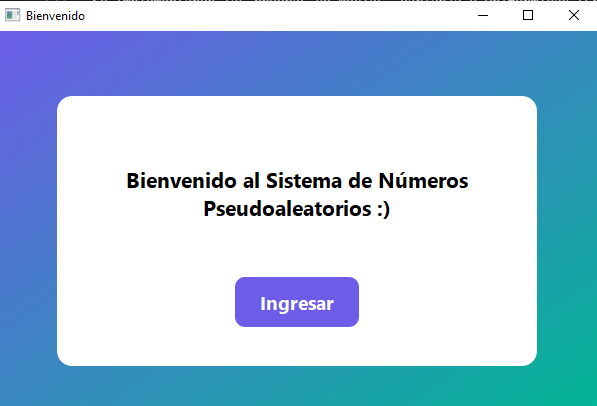
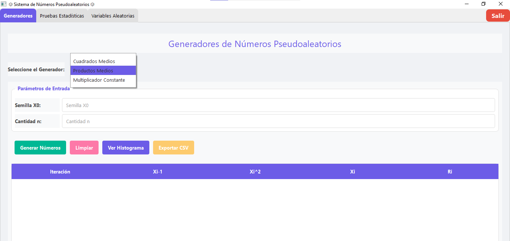
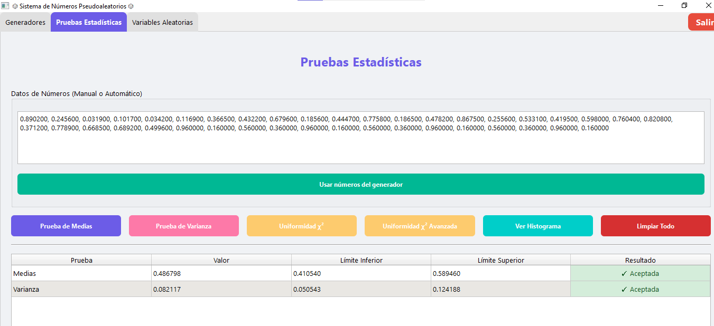
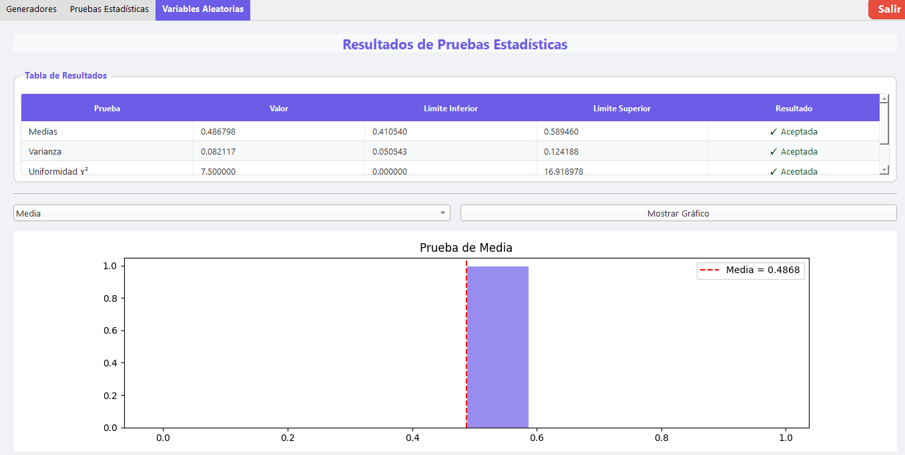
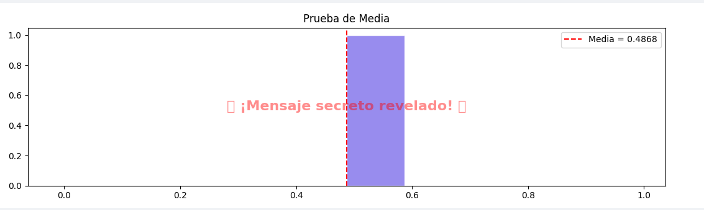

Sistema de Números Pseudoaleatorios

Este proyecto implementa en Python diversos algoritmos para generar números pseudoaleatorios y realizar pruebas estadísticas.
Se tiene la interfaz gráfica desarrollada con PyQt6, con pestañas diferenciadas para generadores, pruebas estadísticas y variables
El sistema permite:
•	Selección de distintos algoritmos generadores.
•	Configuración de parámetros específicos para cada algoritmo.
•	Visualización de resultados numéricos y gráficos.
•	Exportación resultados a CSV de los generadores.

________________________________________
Generadores Implementados
•	Cuadrados Medios: Genera números a partir de una semilla de 4 dígitos.
•	Productos Medios: Genera números usando dos semillas de 4 dígitos.
•	Multiplicador Constante: Emplea una semilla y una constante de 4 dígitos.
•	Generador Congruencial Lineal (LCG): Algoritmo estándar configurable.
•	Numpy RNG: Generador de números aleatorios de NumPy.
•	Random (builtin): Generador estándar de Python.
Pruebas Estadísticas
•	Prueba de Medias: Verifica que la media de los números generados sea cercana a 0.5.
•	Prueba de Varianza: Evalúa si la varianza se aproxima al valor esperado (1/12).
•	Prueba de Uniformidad (Chi-cuadrado): Comprueba si los números se distribuyen uniformemente.
Características de la Interfaz
•	Ventana de bienvenida.
•	Selección de generadores y configuración de parámetros.
•	Visualización de resultados en tablas y gráficos.
•	Pestañas separadas: Generadores, Pruebas Estadísticas, Variables.
________________________________________
Requisitos del Sistema
Software
•	Python 3.10 o superior
•	Librerías:
o	PyQt6
o	numpy
o	matplotlib
o	scipy
Hardware Recomendado
•	Procesador: Dual-core o superior
•	Memoria RAM: 4 GB o más
•	Espacio en disco: 100 MB libres
________________________________________
Instalación y Ejecución
Pasos de Instalación
1.	Clonar o descargar el proyecto:
"git clone <URL_DEL_REPOSITORIO>"
2.	Crear un entorno virtual (opcional):
"python -m venv venv"
Activar entorno:
•	Linux/Mac: "source venv/bin/activate"
•	Windows: "venv\Scripts\activate"
3.	Instalar dependencias:
"pip install -r requerimientos.txt"
PyQt6==6.5.1
numpy==1.25.0
matplotlib==3.8.0
scipy==1.12.0
Explicación de las dependencias:

PyQt6==6.5.1

Función: Crear interfaces gráficas modernas con ventanas, pestañas, botones y layouts.

Uso: Toda la GUI, ventanas de bienvenida, pestañas y botones de interacción.

numpy==1.25.0

Función: Manejo de arrays y operaciones matemáticas avanzadas.

Uso: Generación de números pseudoaleatorios y cálculos estadísticos.

matplotlib==3.8.0

Función: Creación de gráficos y visualizaciones.

Uso: Mostrar histogramas y gráficos de distribución.

scipy==1.12.0

Función: Funciones estadísticas y herramientas científicas.

Uso: Realización de pruebas estadísticas como chi-cuadrado.
4.	Ejecutar la aplicación:
"python main.py"
________________________________________
Instrucciones de Uso
Generación de Números
1.	Seleccionar la pestaña Generadores.
2.	Elegir el algoritmo deseado.
3.	Completar los parámetros:
•	Cuadrados Medios: n y semilla (4 dígitos)
•	Productos Medios: n, semilla y semilla 2 (4 dígitos)
•	Multiplicador Constante: n, semilla y constante (4 dígitos)
•	LCG, Numpy RNG, Random: n y semilla (entero cualquiera)
4.	Hacer clic en Generar Números.
Realización de Pruebas
1.	Ir a la pestaña Pruebas Estadísticas.
•   Presionar prueba media
•   Presionar prueba varianza
•   Presionar pruena uniformidad
2.	Configurar nivel de significancia (α) y número de intervalos (k).
•   En esta parte se hace el calculo donde se ve la tabla de frecuencia y es bajo los numeros generados.
Visualización de Resultados
•	Resultados numéricos en tablas correspondientes.
•	Gráficos de pruebas.
•	Aplicacion en los graficos con un mensaje oculto.
Salir del Sistema
•	Hacer clic en Salir en la esquina superior derecha.
3. Descargar el proyecto del siguiente repositorio

Bitácora de Avances por Clase

Clase 1 – Planificación y Conceptos:
Se definieron los objetivos del proyecto y la estructura de la interfaz. Se revisaron los conceptos de números pseudoaleatorios, generación de secuencias y pruebas estadísticas básicas (media, varianza y uniformidad).

Clase 2 – Implementación de Generadores Básicos:
Se desarrollaron los generadores: Cuadrados Medios, Productos Medios y Multiplicador Constante. Se habilitó la entrada de parámetros como semilla, constante y número de elementos, y se verificó la generación de secuencias numéricas.

Clase 3 – Generadores Avanzados y Conexión con Pruebas:
Se incorporaron generadores LCG, Numpy RNG y Random (builtin). Se estableció la comunicación entre los generadores y la pestaña de Pruebas Estadísticas para procesar y visualizar resultados. Se inició la implementación de gráficos y tablas para mostrar los números generados.

Clase 4 – Pruebas Estadísticas e Interfaz Final:
Se implementaron las pruebas de Medias, Varianza y Uniformidad (Chi-cuadrado) con configuración de nivel de significancia (α) y número de intervalos (k). Se completó la interfaz, incluyendo ventana de bienvenida, pestañas separadas, botón Salir y mensaje oculto. Los resultados se muestran en tablas y gráficos.
## Capturas de Pantalla

**Ventana de Bienvenida**  

**Pestaña Generadores**  

**Pestaña Pruebas Estadísticas**  

**Resultados / Gráficos**  

**Mensaje Oculto**  

