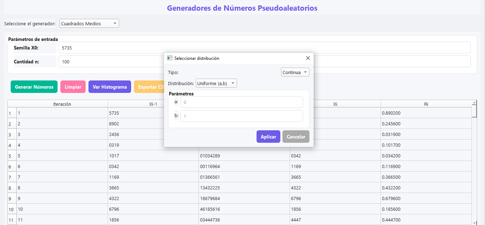
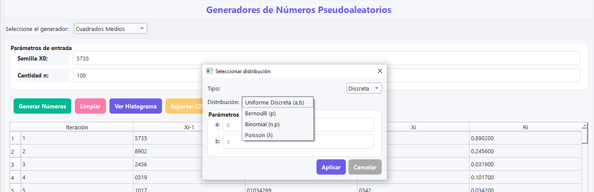
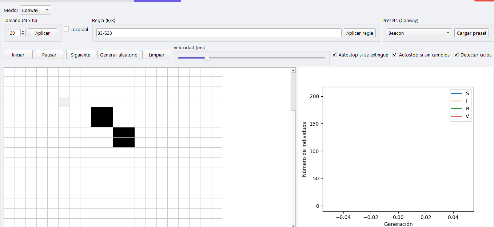
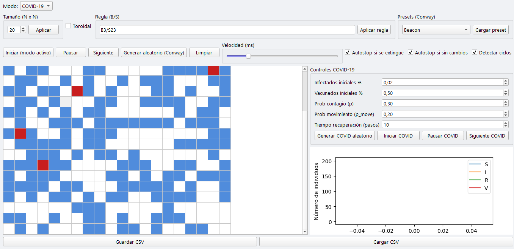

Sistema de Números Pseudoaleatorios

Este proyecto implementa en Python diversos algoritmos para generar números pseudoaleatorios y realizar pruebas estadísticas.
Se tiene la interfaz gráfica desarrollada con PyQt6, con pestañas diferenciadas para generadores, pruebas estadísticas y variables
El sistema permite:
•	Selección de distintos algoritmos generadores.
•	Configuración de parámetros específicos para cada algoritmo.
•	Visualización de resultados numéricos y gráficos.
•	Exportación resultados a CSV de los generadores.

________________________________________
Generadores Implementados
•	Cuadrados Medios: Genera números a partir de una semilla de 4 dígitos.
•	Productos Medios: Genera números usando dos semillas de 4 dígitos.
•	Multiplicador Constante: Emplea una semilla y una constante de 4 dígitos.
•	Generador Congruencial Lineal (LCG): Algoritmo estándar configurable.
•	Numpy RNG: Generador de números aleatorios de NumPy.
•	Random (builtin): Generador estándar de Python.
Pruebas Estadísticas
•	Prueba de Medias: Verifica que la media de los números generados sea cercana a 0.5.
•	Prueba de Varianza: Evalúa si la varianza se aproxima al valor esperado (1/12).
•	Prueba de Uniformidad (Chi-cuadrado): Comprueba si los números se distribuyen uniformemente.
Características de la Interfaz
•	Ventana de bienvenida.
•	Selección de generadores y configuración de parámetros.
•	Visualización de resultados en tablas y gráficos.
•	Pestañas separadas: Generadores, Pruebas Estadísticas, Variables.
________________________________________
Requisitos del Sistema
Software
•	Python 3.10 o superior
•	Librerías:
o	PyQt6
o	numpy
o	matplotlib
o	scipy
Hardware Recomendado
•	Procesador: Dual-core o superior
•	Memoria RAM: 4 GB o más
•	Espacio en disco: 100 MB libres
________________________________________
Instalación y Ejecución
Pasos de Instalación
1.	Clonar o descargar el proyecto:
"git clone <https://github.com/GuddyTicona/Proyecto_simulacion.git>"
2.	Crear un entorno virtual (opcional):
"python -m venv venv"
Activar entorno:
•	Linux/Mac: "source venv/bin/activate"
•	Windows: "venv\Scripts\activate"
3.	Instalar dependencias:
"pip install -r requerimientos.txt"
PyQt6==6.5.1
numpy==1.25.0
matplotlib==3.8.0
scipy==1.12.0
Explicación de las dependencias:

PyQt6==6.5.1

Función: Crear interfaces gráficas modernas con ventanas, pestañas, botones y layouts.

Uso: Toda la GUI, ventanas de bienvenida, pestañas y botones de interacción.

numpy==1.25.0

Función: Manejo de arrays y operaciones matemáticas avanzadas.

Uso: Generación de números pseudoaleatorios y cálculos estadísticos.

matplotlib==3.8.0

Función: Creación de gráficos y visualizaciones.

Uso: Mostrar histogramas y gráficos de distribución.

scipy==1.12.0

Función: Funciones estadísticas y herramientas científicas.

Uso: Realización de pruebas estadísticas como chi-cuadrado.
4.	Ejecutar la aplicación:
"python main.py"
________________________________________
Instrucciones de Uso
Generación de Números
1.	Seleccionar la pestaña Generadores.
2.	Elegir el algoritmo deseado.
3.	Completar los parámetros:
•	Cuadrados Medios: n y semilla (4 dígitos)
•	Productos Medios: n, semilla y semilla 2 (4 dígitos)
•	Multiplicador Constante: n, semilla y constante (4 dígitos)
•	LCG, Numpy RNG, Random: n y semilla (entero cualquiera)
4.	Hacer clic en Generar Números.
Realización de Pruebas
1.	Ir a la pestaña Pruebas Estadísticas.
•   Presionar prueba media
•   Presionar prueba varianza
•   Presionar pruena uniformidad
2.	Configurar nivel de significancia (α) y número de intervalos (k).
•   En esta parte se hace el calculo donde se ve la tabla de frecuencia y es bajo los numeros generados.
Visualización de Resultados
•	Resultados numéricos en tablas correspondientes.
•	Gráficos de pruebas.
•	Aplicacion en los graficos con un mensaje oculto.
3. La generecion de los numeros pseudoaleatorios permite realizar las distribuciones cuales son:
•   Distribuciones continuas
•   Distribuciones discretas
Para el funcionamiento insertar los datos al seleccionar las distribuciones de continua o discreta.
seleccionar en distribucion continua:
Uniforme Continua U(a,b)
•   a = mínimo
•   b= maximo

Exponencial Exp(λ)
•   λ = tasa o velocidad del evento
Normal N(μ,σ) (método Box-Muller)
•   μ = promedio
•   σ = desviación estándar
 Gamma Γ(α,β)
•   α = forma
•   β = escala
Weibull (α,β,γ)
•   α = forma
•   β = escala
•   γ = desplazamiento opcional
En ellos se genera al insertar los datos, la tabla y el grafico correspondiente del histograma.
seleccionar en distribucion discreta:
Uniforme Discreta U(a,b)
llenar los siguientes datos
•   a = numero menor
•   b = numero mayor (si es menor el sistema no permite)
Bernoulli(p)
ingresar dato
•   p = probabilidad de éxito (0 a 1)
Binomial(n, p)
•   n = número de intentos
•   p = probabilidad de éxito
Poisson(λ)
λ = eventos esperados por intervalo
En ellos se genera al insertar los datos, la tabla y el grafico correspondiente del histograma.
4. Simulación por Autómata Celular (Conway y COVID-19)

Esta pestaña permite simular comportamientos complejos en una cuadrícula, donde cada celda representa un "individuo" o "célula" que cambia de estado con el tiempo según reglas definidas.

Modo Conway (Juego de la Vida)

Simulación clásica basada en reglas B3/S23:

Nace una célula si tiene exactamente 3 vecinas vivas (B3)

Sobrevive si tiene 2 o 3 vecinas vivas (S23)

Muere en cualquier otro caso

Incluye:

Patrones ya listos (presets): Glider, Blinker, Glider Gun, toad, beacon.

Evolución automática paso a paso

Detección de extinción, estabilidad o repetición de ciclos

Posibilidad de tamaño personalizado de la cuadrícula

- Modo COVID-19 (modelo epidemiológico simple)

Cada celda representa una persona con estado:

•   S	Susceptible (sano, puede contagiarse)
•   I	Infectado (puede contagiar a otros)
•   R	Recuperado (no se vuelve a infectar)
•   V	Vacunado (protegido desde el inicio)

Parámetros configurables por el usuario:

•   % inicial de infectados

•   % inicial de vacunados

•   p_infect: probabilidad de contagio

•   p_move: probabilidad de movimiento entre celdas

•   t_recuperación: tiempo que tarda en pasar de I → R

Incluye:

Movimiento aleatorio dinámico

Gráfico en tiempo real mostrando cómo evoluciona S, I, R y V

Esta simulación permite visualizar de manera interactiva cómo se comporta un sistema vivo o una epidemia, en función de los parámetros elegidos.
Salir del Sistema
•	Hacer clic en Salir en la esquina superior derecha.
4. Descargar el proyecto del siguiente repositorio

Bitácora de Avances por Clase

Clase 1 – Planificación y Conceptos:
Se definieron los objetivos del proyecto y la estructura de la interfaz. Se revisaron los conceptos de números pseudoaleatorios, generación de secuencias y pruebas estadísticas básicas (media, varianza y uniformidad).

Clase 2 – Implementación de Generadores Básicos:
Se desarrollaron los generadores: Cuadrados Medios, Productos Medios y Multiplicador Constante. Se habilitó la entrada de parámetros como semilla, constante y número de elementos, y se verificó la generación de secuencias numéricas.

Clase 3 – Generadores Avanzados y Conexión con Pruebas:
Se incorporaron generadores LCG, Numpy RNG y Random (builtin). Se estableció la comunicación entre los generadores y la pestaña de Pruebas Estadísticas para procesar y visualizar resultados. Se inició la implementación de gráficos y tablas para mostrar los números generados.

Clase 4 – Pruebas Estadísticas e Interfaz Final:
Se implementaron las pruebas de Medias, Varianza y Uniformidad (Chi-cuadrado) con configuración de nivel de significancia (α) y número de intervalos (k). Se completó la interfaz, incluyendo ventana de bienvenida, pestañas separadas, botón Salir y mensaje oculto. Los resultados se muestran en tablas y gráficos.
Clase 5 – Variables Aleatorias (Distribuciones):
Se implementó la pestaña de Variables Aleatorias, agregando distribuciones continuas (Uniforme, Exponencial, Normal, Gamma, Weibull) y discretas (Uniforme Discreta, Bernoulli, Binomial, Poisson). Las distribuciones utilizan los números Ri generados en la pestaña anterior y muestran valores generados, parámetros, media y varianza teórica.

Clase 6 – Simulación con Autómata Celular (Conway y COVID-19):
Se añadió una pestaña independiente para simular autómatas celulares.
Incluye el Juego de la Vida de Conway con presets (Glider, Blinker, etc.), modo automático y detección de ciclos/extinción, y un modo COVID-19 con estados S, I, R, V, parámetros configurables y gráfico dinámico de evolución epidemiológica.
## Capturas de Pantalla

**Ventana de Bienvenida**  

**Pestaña Generadores**  

**Pestaña Pruebas Estadísticas**  

**Resultados / Gráficos**  

**Distribucion continua**

**Distribucion discreta**

**Automata celular juego de la vida conway**

**Automata celular covid**

**Mensaje Oculto**  

